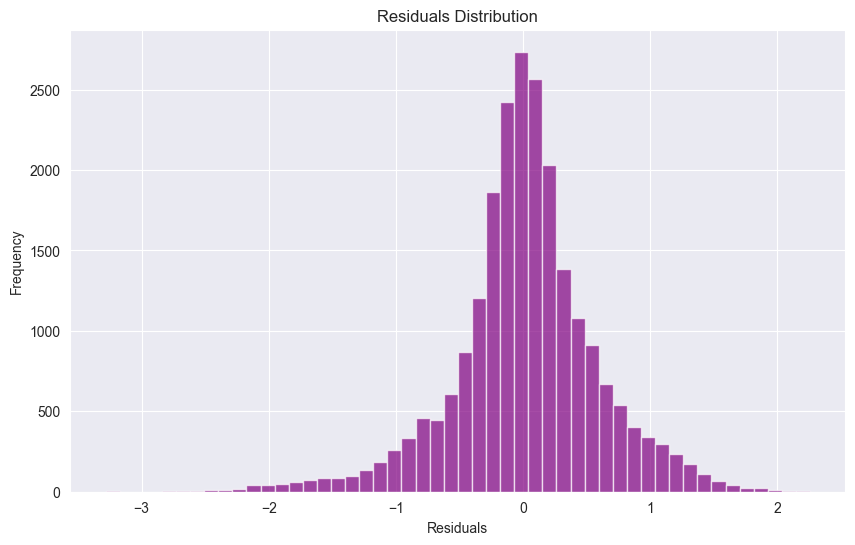

# Advanced Time Series Sales Prediction Using Walmart Dataset

This project focuses on predicting Walmart's weekly store sales using advanced time-series modeling techniques. The project leverages LSTM-based models (including a Bidirectional LSTM) as well as Random Forest for comparison and ensemble modeling. The primary goal is to capture complex patterns such as trends, seasonality, and other variations within the data to provide accurate and reliable sales forecasts, aiding business strategy and decision-making.

## About the Walmart Dataset

The Walmart dataset consists of weekly sales data for multiple stores, along with various factors that may influence sales. This includes promotional events, holidays, and economic indicators, offering a challenging real-world dataset for time-series forecasting tasks. By accurately capturing this data's complexities, this project aims to improve future sales predictions and support strategic business insights.


## Project Structure

. ├── data/ │ ├── optimized_dataset.csv │ ├── scaler.pkl │ ├── random_forest_model.pkl │ ├── bilstm_model.h5 ├── notebooks/ │ ├── Notebook1-DataCleaning.ipynb │ ├── Notebook2-ModelDevelopment.ipynb ├── README.md


## Project Highlights

### 1. Data Cleaning and Preprocessing
- **File**: `Notebook1-DataCleaning.ipynb`
- **Key Steps**:
  - Loaded and preprocessed the dataset.
  - Addressed missing values, outliers, and standardized sales data.
  - Extracted date-based features like month, week, and day of the week for improved temporal predictions.
- **Tools Used**: `pandas`, `numpy`

### 2. Feature Engineering
- Extracted temporal features to enrich data:
  - **Month**, **Week of Year**, and **Day of Week** features were created using the `Date` column.
- Resulting dataset was divided into train and test sets for modeling.

### 3. Model Development
- **File**: `Notebook2-ModelDevelopment.ipynb`
- **Models Used**:
  - LSTM with various configurations.
  - Bidirectional LSTM.
  - Random Forest Regressor for baseline and ensemble comparison.
- **Key Results**:
  - Best performance achieved using the Bidirectional LSTM with a Mean Absolute Error (MAE) of **0.4099** and R-squared value of **0.6379**.

### 4. Model Training and Evaluation
- **Bidirectional LSTM**:
  - Improved prediction accuracy by leveraging bidirectional context of the time series data.
  - **Performance Metrics**:
    - Mean Absolute Error (MAE): `0.4099`
    - Mean Squared Error (MSE): `0.3300`
    - R-squared: `0.6379`
- **Random Forest**:
  - Used for baseline comparisons and ensemble predictions.
  - Combined with LSTM predictions to improve accuracy using a simple average ensemble.

### 5. Visualization of Predictions
- Actual vs Predicted plots for different model segments.
- Illustrations highlighting ensemble performance compared to individual models.


## Sample Visualizations

### Residuals Distribution


---

### Actual Predicted Sales (Segment 0-1000)


---

### Actual Predicted Sales (Segment 10000-11000)


## Installation and Usage

1. Clone this repository:
   ```bash
   git clone https://github.com/yourusername/sales-prediction-project.git
   cd sales-prediction-project
   
2.Install the dependencies:
  pip install -r requirements.txt

3.Run the Jupyter notebooks:
  jupyter notebook
  Notebook1-DataCleaning.ipynb for data cleaning and preprocessing.
  Notebook2-ModelDevelopment.ipynb for model training, evaluation, and prediction.

## Key Files

- **`optimized_dataset.csv`**: The preprocessed dataset used for training and testing.
- **`bilstm_model.h5`**: Saved model weights for the Bidirectional LSTM.
- **`scaler.pkl`**: Scaler object for data standardization.
- **`random_forest_model.pkl`**: Saved Random Forest model for baseline comparison.

## Results Summary

- The Bidirectional LSTM model outperformed other configurations, achieving the best balance between prediction accuracy and computational complexity.
- The ensemble model combining LSTM and Random Forest predictions further demonstrated robust performance improvements.

## License

This project is licensed under the MIT License.

## Contact

For questions or collaboration, please contact [egemen.oezen@gmail.com].

